# Dockerizing a Static Website Codebase and Deploying the Built Image to an AWS EC2 Instance using Docker Hub as the Container Registry

## Project Overview

1. Clone the static website codebase.
2. Create a Dockerfile to dockerize it with Nginx.
3. Built and test the Docker image locally.
4. Push the image to Docker Hub.
5. Launch an EC2 instance with Docker.
6. Pull the image from Docker Hub and ran the container on EC2.
7. Access the website via the EC2 public IP.


## Prerequisites
Before starting, ensure you have:

- Docker: Installed locally (run docker --version to check). Get it from docker.com.
- Docker Hub Account: Sign up at hub.docker.com. Username and password will be needed.
- AWS Account: Sign up at aws.amazon.com.
- Git: Installed to clone the repo (run git --version). Get it from git-scm.com.
- Terminal: Command Prompt/PowerShell (Windows), Terminal (Mac), or Linux terminal.
- GitHub Repo: Access to https://github.com/devopsthepracticalway/bootcamp-1-project-1a.git.

#

### Step 1: Clone the GitHub Repository.

#### 1. Open an empty folder 

- Open your terminal and navigate to a folder (in my case is **Docker-project**) to clone the codebase the from GitHub repo. [Project-GitHub Url](https://github.com/devopsthepracticalway/bootcamp-1-project-1a.git)

```bash
# Download the folder with the codebase
git clone https://github.com/devopsthepracticalway/bootcamp-1-project-1a.git
```
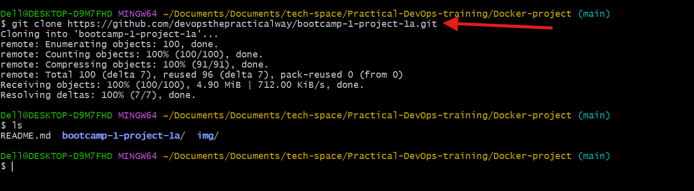

#### 2. Move into the project folder  **"bootcamp-1-project-1a"** 
- Check the file inside the folder. We should have files like index.html, css/, js/. These are the static website files we’ll dockerize.

```bash
# Move into the project folder
cd bootcamp-1-project-1a

# Check the files inside folder
ls
```
### Step 2: Create a Dockerfile

We need a Dockerfile to dockerize the website. Since it’s a static site, we’ll use Nginx to serve the files.

#### 1. Create a Dockerfile

- In the bootcamp-1-project-1a folder, create a file named Dockerfile (no extension)
Using any text editor. 

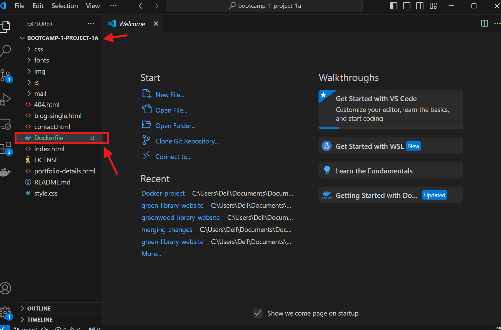

#### 2. Add Content to the Dockerfile 

-  Inside the Dockerfile add and save:
```bash 
FROM nginx:alpine  # The base image uses a lightweight Nginx image to serve static files.

WORKDIR /usr/share/nginx/html # Sets the working directory to Nginx’s default web folder.

COPY . .  # Copies all files (e.g., index.html, css/) from the project folder to the container.

EXPOSE 80  # Indicates the container uses port 80 (HTTP).

CMD ["nginx", "-g", "daemon off;"] # Starts Nginx.
```

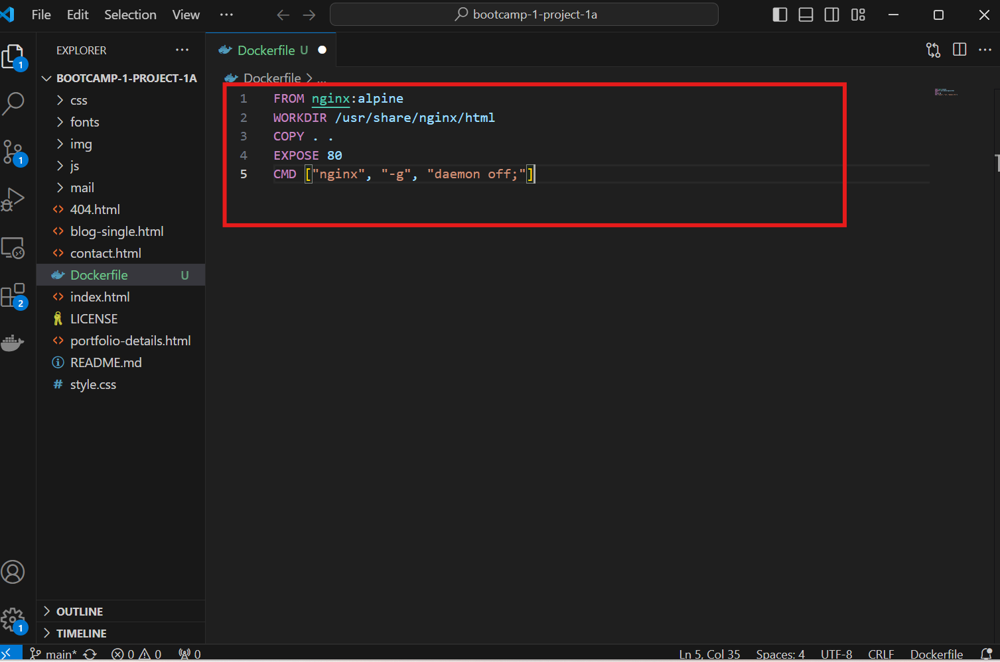

### Step 3: Build the Docker Image Locally

Build the Docker image locally to test it before pushing to Docker Hub.

#### 1.  Building the Image
- From the terminal, still In the bootcamp-1-project-1a folder use the docker command below to buld the image.

```bash
docker build -t my-website:latest .
```
- -t my-website:latest: Give the image name  "**my-website**" with tag "**latest**"

- **.**  : The dot means use the Dockerfile in the current folder.

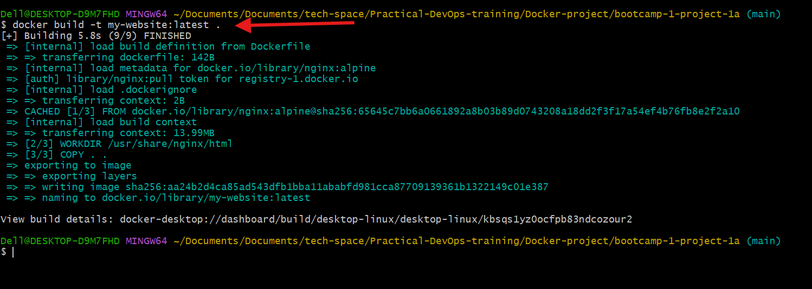

#### 2. Verify the Image

- Use the docker command below to confirm the build image

```bash
# Confirms the build image
docker images
```
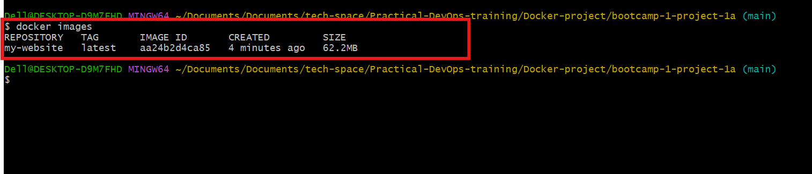

#### 3. Run the Container Locally and Test

- To run  and confirm the container is runing, use the docker command below:
```bash 
# Run the container
docker run -d -p 8080:80 --name my-website-container my-website:latest

# Confirm the container is runing
docker ps
```
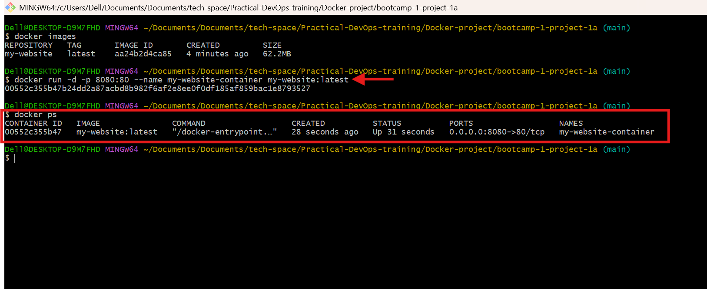

- Open your browser and go to http://localhost:8080 to see the website.


- Stop and Remove the Container

```bash 
# Stop container
docker stop my-website-container

# Delete container
docker rm my-website-container
```
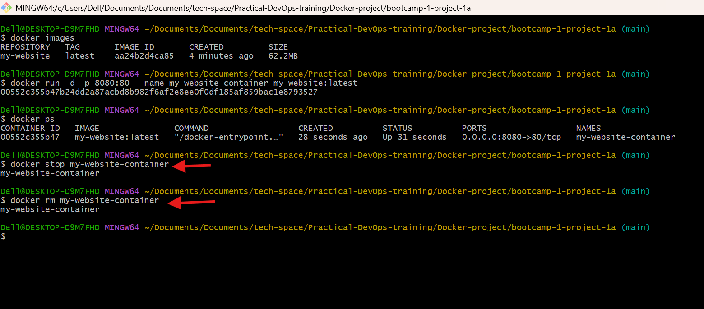

### Step 4: Push the Image to Docker Hub

Push the my-website image to Docker Hub so that EC2 instance can pull it.

#### 1. Log in to Docker Hub:

- Login to docker hub using the terminal 
```bash
# Login to docker hub
docker login
```

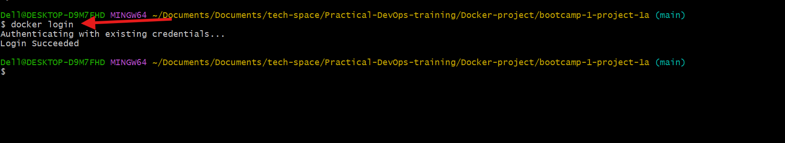

#### 2. Tag the Image for Docker Hub

- Use the docker command below to tag the image
```bash
# Tag docker image -Note:My docker hub username is wilfred2018.
docker tag my-website:latest wilfred2018/my-website:latest
```
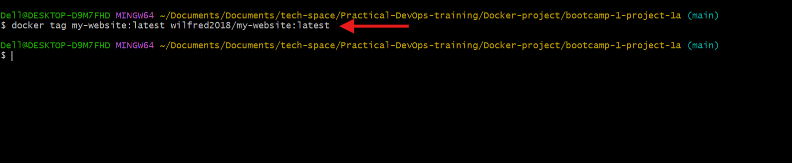

#### 3. Push the Image

- Push the image using the docker command below
```bash
# Push image 
docker push wilfred2018/my-website:latest
```
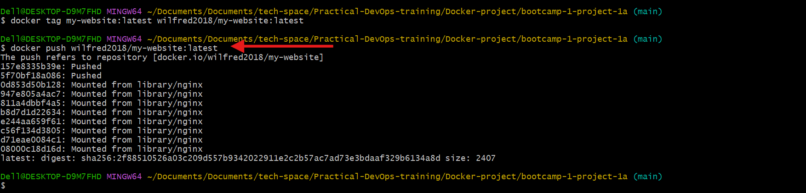

#### 4. Verify on Docker Hub
- Go to hub.docker.com and log in.
Check your repositories. You should see <your-username>/my-website.

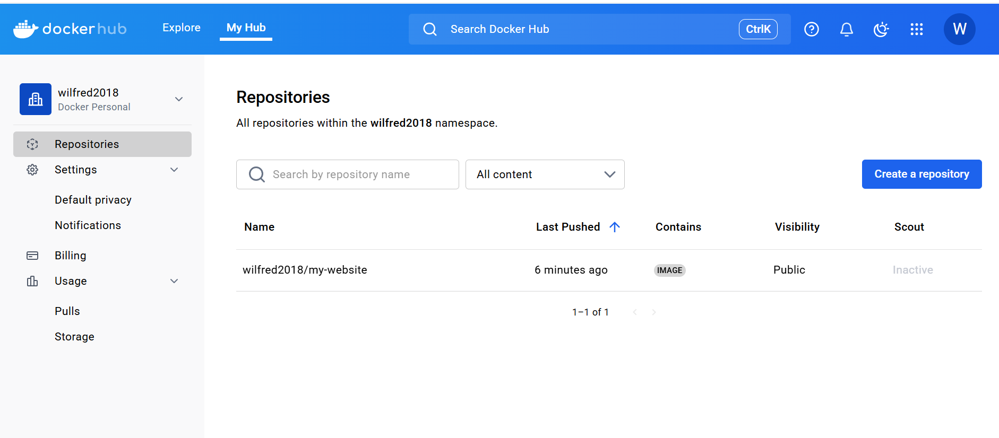

### Step 5: Launch an AWS EC2 Instance

Create an EC2 instance to run the container.
#### 1.  Log in to AWS Console:

-  Go to console.aws.amazon.com.

-  Set your region (I used us-east-1) in  the top-right corner.
#### 2.  Go to EC2:

- Search for “EC2” and click EC2.
- Click Launch instance.

#### 3. Configure the Instance:
- Name: Enter my-website-server.
- Amazon Machine Image (AMI): Select an Ubuntu Server AMI (Ubuntu Server 22.04 LTS free Tier eligible).

- Instance Type: Select t2.micro (Free Tier eligible).

- Key Pair:
Choose an existing key pair or create a new one. Download the .pem file  and save it securely.

- Network Settings:

i. Click Edit.

- VPC: Use the default VPC.

- Subnet: Choose a public subnet (e.g., us-east-1a).

- Auto-assign public IP: Enable.

- Security Group:
Create a new security group and add rules:
HTTP: Port 80, Source: Anywhere (0.0.0.0/0).
SSH: Port 22, Source: anywhere (0.0.0.0/0).


- Storage: Keep default (8 GiB gp3, Free Tier eligible).

ii. Advanced Details (optional)

- User Data (to install Docker):
To automate updates and Docker installation during launch, add this script below in the User Data field before launching the instance.


```bash
#!/bin/bash
apt update
apt upgrade -y
apt install -y docker.io
systemctl start docker
systemctl enable docker
usermod -aG docker ubuntu
```
- Click Launch instance to create an Ec2 instance

### Step 6: Connect to the EC2 Instance

#### 1. SSH into the Instance:
- Navigate to where your key pair is: Connect using your key-pair.

```bash
# Example of a key-pair
ssh -i my-key-pair.pem ec2-user@<public-ip>
```

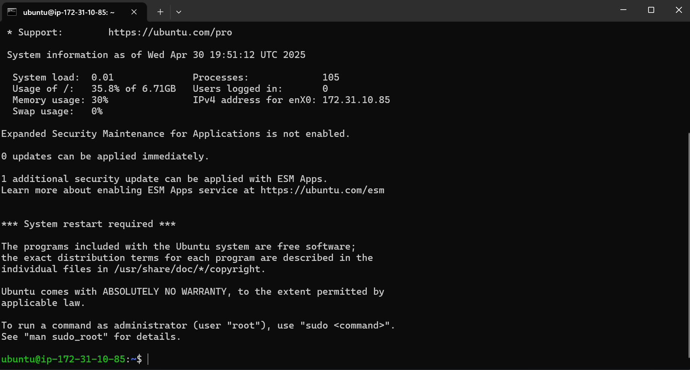

##### 2. Verify Docker

- Use the docker command below to confirm docker is installed.
```bash 
# confirm docker is installed
docker --version
```
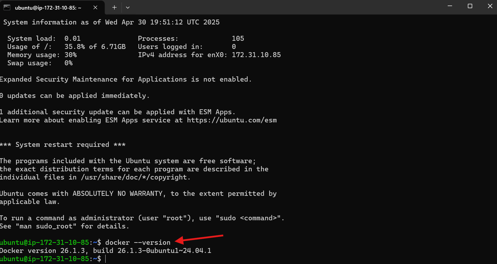

- Log out and SSH back in again

### Step 7: Pull and Run the Docker Container on EC2
#### 1. Login to Docker Hub 

- Login using the docker command below and enter your docker hub username and password

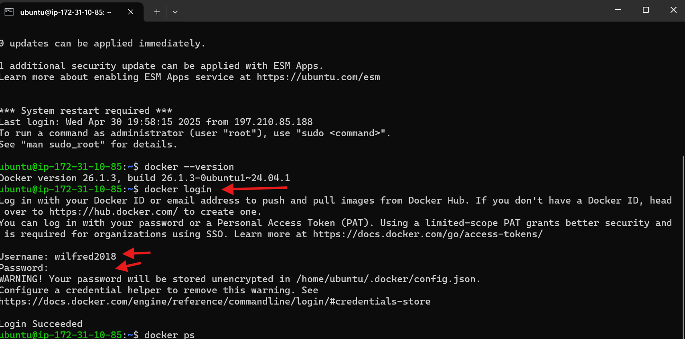

#### 2. Pull the Image:

- Pull the image by using the docker command below.

```bash
# Pull the image from docker hub
docker pull wilfred2018/my-website:latest
```

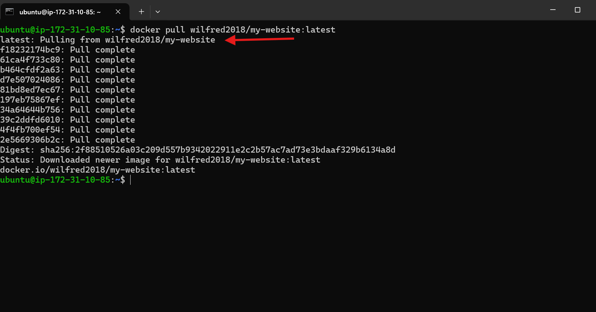

#### 3. Run the Container:

- Run the container using this docker command below

```bash
# Run the container
 
```

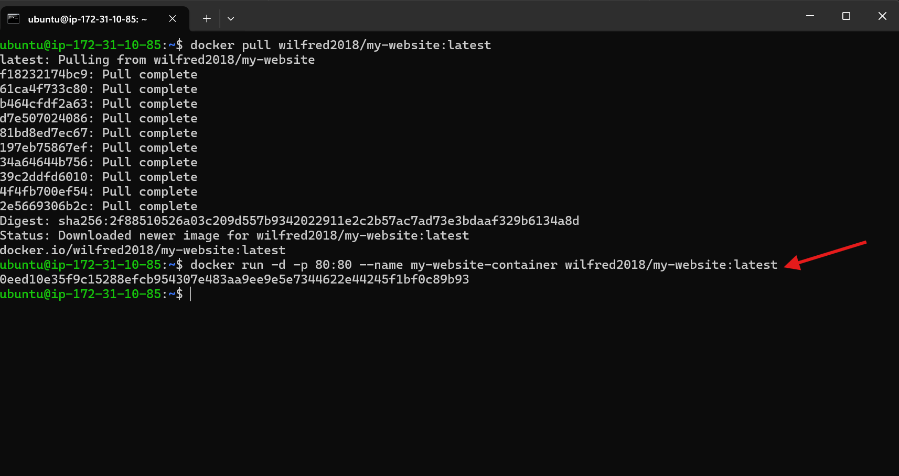

#### 4. Verify the container is  Running

- To confirm the container use the docker command below

```bash
# confirm it's runing
docker ps
```
You can see my-wesite-container with status is "UP".
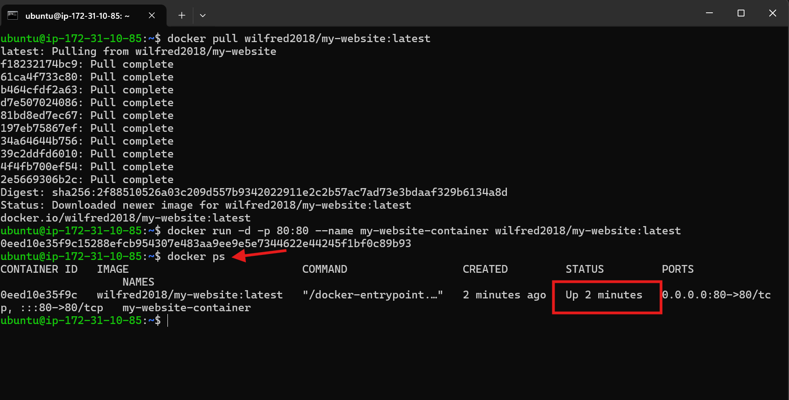


### Step 8: Access the Website

#### 1. Open Your Browser:

- Go to http://<public-ip> (http://44.200.248.93/).


#
